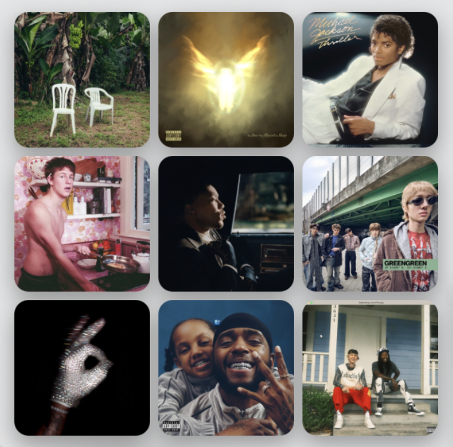

# recent-album-covers

> A 3x3 mosaic of your recently played album covers.

A widget for [Übersicht](http://tracesof.net/uebersicht/), self-contained in
`index.jsx`. Out of the box it ranks your local Music library by play count;
connect it to the Apple Music (MusicKit) API (below) for true recently-played
ordering with correct artwork.



### On the desktop

The widget shown running alongside the full set:

<video src="https://github.com/jke48222/recent-album-covers-widget/raw/main/homescreen.mp4" controls width="100%"></video>

## Install

1. Install and run [Übersicht](http://tracesof.net/uebersicht/).
2. Unzip `recent-album-covers.widget.zip`, or copy the
   `recent-album-covers.widget` folder into your Übersicht widgets directory:
   `~/Library/Application Support/Übersicht/widgets/`
3. Refresh Übersicht (menu bar icon -> Refresh All).

Without the MusicKit setup, the widget uses your local Music library (covers
resolved via the public iTunes Search API), then deterministic color tiles.

## Connect to Apple Music / MusicKit (optional)

The widget prefers a local helper that calls the Apple Music API for your
recently-played tracks. When it is absent or returns nothing, the widget falls
back to the local library, so this step is optional.

1. Create the config directory and copy the helpers:
   ```sh
   mkdir -p ~/.config/widgetsuite
   cp setup/musickit-fetch.py setup/musickit-setup.sh ~/.config/widgetsuite/
   ```
2. In the [Apple Developer portal](https://developer.apple.com/account) create a
   **MusicKit identifier** and a **private key (.p8)**. Note the Key ID and your
   Team ID, then place:
   ```sh
   #  ~/.config/widgetsuite/musickit.p8     (the downloaded private key)
   #  ~/.config/widgetsuite/musickit.json   {"keyId": "ABC123DEF4", "teamId": "TEAMID1234"}
   ```
3. Authorize your Apple Music account to get a Music User Token:
   ```sh
   bash ~/.config/widgetsuite/musickit-setup.sh
   # click "Authorize Apple Music", sign in, then paste the token shown into:
   #  ~/.config/widgetsuite/musickit-user-token.txt
   ```
4. Refresh Übersicht.

Your `.p8`, tokens, and `musickit.json` stay on your machine and are never
committed (see `.gitignore`). An Apple Developer Program membership is required
for MusicKit keys.

## How to edit

- Tile count and styling: `index.jsx` (the `className` and the 3x3 grid in
  `render()`).
- All styling is in the inlined design-system block at the top of `index.jsx`.

## Bundled files

- `recent-album-covers.widget/index.jsx` — the widget
- `setup/musickit-fetch.py` — optional Apple Music helper (no keys included)
- `setup/musickit-setup.sh` — one-time MusicKit authorization helper

## Other widgets

- [Animated Wallpaper](https://github.com/jke48222/animated-wallpaper-widget)
- [Clipboard History](https://github.com/jke48222/clipboard-history-widget)
- [Daily AI Prompt](https://github.com/jke48222/daily-ai-prompt-widget)
- [Daily Astronomy Photo](https://github.com/jke48222/daily-astronomy-photo-widget)
- [Daily Tarot](https://github.com/jke48222/daily-tarot-widget)
- [GitHub Contributions](https://github.com/jke48222/github-contributions-widget)
- [Now Playing](https://github.com/jke48222/now-playing-widget)
- [Recent Downloads](https://github.com/jke48222/recent-downloads-widget)
- [Rotating 3D Model](https://github.com/jke48222/rotating-3d-model-widget)
- [Spinning Globe](https://github.com/jke48222/spinning-globe-widget)
- [Wallpaper Switcher](https://github.com/jke48222/wallpaper-switcher-widget)

## Author

Jalen Edusei <jalen.edusei@gmail.com>
