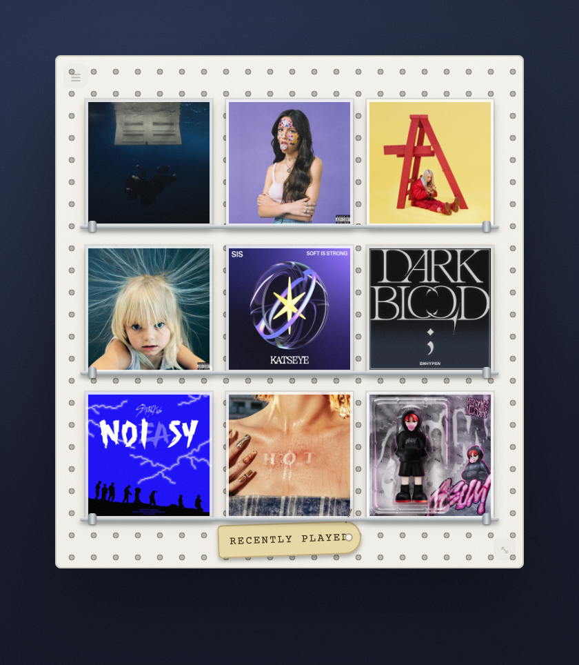

# recent-album-covers

> A 3x3 mosaic of your recently played album covers.

[](https://github.com/jke48222/recent-album-covers-widget/releases/latest) [](LICENSE) 

[Übersicht gallery](https://tracesof.net/uebersicht-widgets/) · [Widget suite](https://github.com/jke48222/widget-suite) · [Download](https://github.com/jke48222/recent-album-covers-widget/releases/latest) · [Setup guide](docs/SETUP.md) · [Troubleshooting](docs/TROUBLESHOOTING.md)

A widget for [Übersicht](http://tracesof.net/uebersicht/), self-contained in
`index.jsx`. Out of the box it ranks your local Music library by play count.
Connect **Spotify** and/or **Apple Music (MusicKit)** (below) for true
recently-played ordering with correct artwork — whichever source is configured
and returns data is used first (Spotify, then Apple Music, then local).



### On the desktop

The widget running alongside the full set:


[Full-resolution video](media/homescreen.mp4)

## Requirements

- macOS with [Übersicht](https://tracesof.net/uebersicht/) installed (`brew install --cask ubersicht`)
- Optional: Spotify (see below)
- Optional: Apple Music / MusicKit (see below)

## Install

If you don't have Übersicht yet:

```sh
brew install --cask ubersicht
```

**One-click.** Clone the repo and run the installer. It copies the widget into Übersicht's widgets folder, installs any helper scripts, and runs setup if the widget needs it. Safe to re-run.

```sh
git clone https://github.com/jke48222/recent-album-covers-widget.git
cd recent-album-covers-widget && ./install.sh
```

**Manual.** Download `recent-album-covers.widget.zip` from the [latest release](https://github.com/jke48222/recent-album-covers-widget/releases/latest), unzip it, and put the `recent-album-covers.widget` folder in `~/Library/Application Support/Übersicht/widgets/`. Then refresh Übersicht (menu bar icon → Refresh All).

Without any setup, the widget uses your local Music library (covers resolved via
the public iTunes Search API), then deterministic color tiles.

Blank widget? Run `./check.sh` for a pass/fail diagnosis, or see [docs/TROUBLESHOOTING.md](docs/TROUBLESHOOTING.md).

## Connect to Spotify (optional)

Uses the Spotify Web API for your recently-played albums.

1. Copy the helpers:
   ```sh
   mkdir -p ~/.config/widgetsuite
   cp setup/spotify-fetch.py setup/spotify-setup.py ~/.config/widgetsuite/
   ```
2. Create an app at https://developer.spotify.com/dashboard, add the redirect URI
   `http://127.0.0.1:8723/callback`, then save its credentials:
   ```sh
   #  ~/.config/widgetsuite/spotify.json  {"client_id": "...", "client_secret": "..."}
   ```
3. Authorize (opens your browser, then writes a refresh token back):
   ```sh
   /usr/bin/python3 ~/.config/widgetsuite/spotify-setup.py
   ```
4. Refresh Übersicht.

Your credentials and token stay on your machine and are never committed
(see `.gitignore`).

## Connect to Apple Music / MusicKit (optional)

The widget prefers a local helper that calls the Apple Music API for your
recently-played tracks. When it is absent or returns nothing, the widget falls
back to the local library, so this step is optional.

1. Create the config directory and copy the helpers:
   ```sh
   mkdir -p ~/.config/widgetsuite
   cp setup/musickit-fetch.py setup/musickit-setup.sh ~/.config/widgetsuite/
   ```
2. In the [Apple Developer portal](https://developer.apple.com/account) create a
   **MusicKit identifier** and a **private key (.p8)**. Note the Key ID and your
   Team ID, then place:
   ```sh
   #  ~/.config/widgetsuite/musickit.p8     (the downloaded private key)
   #  ~/.config/widgetsuite/musickit.json   {"keyId": "ABC123DEF4", "teamId": "TEAMID1234"}
   ```
3. Authorize your Apple Music account to get a Music User Token:
   ```sh
   bash ~/.config/widgetsuite/musickit-setup.sh
   # click "Authorize Apple Music", sign in, then paste the token shown into:
   #  ~/.config/widgetsuite/musickit-user-token.txt
   ```
4. Refresh Übersicht.

Your `.p8`, tokens, and `musickit.json` stay on your machine and are never
committed (see `.gitignore`). An Apple Developer Program membership is required
for MusicKit keys.

## Customization

- Tile count and styling: `index.jsx` (the `className` and the 3x3 grid in
  `render()`).
- All styling is in the inlined design-system block at the top of `index.jsx`.

## Bundled files

- `recent-album-covers.widget/index.jsx` — the widget
- `setup/spotify-fetch.py` — optional Spotify recently-played helper (no keys included)
- `setup/spotify-setup.py` — one-time Spotify OAuth helper
- `setup/musickit-fetch.py` — optional Apple Music helper (no keys included)
- `setup/musickit-setup.sh` — one-time MusicKit authorization helper
- `install.sh` / `install.command` — one-click installer (copies the widget into Übersicht and installs any helpers)
- `check.sh` — read-only setup diagnostics; prints pass/fail per item

## Related widgets

Part of the [Übersicht Widget Suite](https://github.com/jke48222/widget-suite): 16 widgets that share one design system.

- [Agent Fleet](https://github.com/jke48222/agent-fleet-widget)
- [Animated Wallpaper](https://github.com/jke48222/animated-wallpaper-widget)
- [Clipboard History](https://github.com/jke48222/clipboard-history-widget)
- [Daily AI Prompt](https://github.com/jke48222/daily-ai-prompt-widget)
- [Daily Astronomy Photo](https://github.com/jke48222/daily-astronomy-photo-widget)
- [Daily Tarot](https://github.com/jke48222/daily-tarot-widget)
- [GitHub Contributions](https://github.com/jke48222/github-contributions-widget)
- [Keys & Pads](https://github.com/jke48222/keys-and-pads-widget)
- [Now Playing](https://github.com/jke48222/now-playing-widget)
- [Pi Fleet](https://github.com/jke48222/pi-fleet-widget)
- [Recent Downloads](https://github.com/jke48222/recent-downloads-widget)
- [Rotating 3D Model](https://github.com/jke48222/rotating-3d-model-widget)
- [Spinning Globe](https://github.com/jke48222/spinning-globe-widget)
- [Wallpaper Switcher](https://github.com/jke48222/wallpaper-switcher-widget)
- [Window Pet](https://github.com/jke48222/window-pet-widget)

## License

MIT. See [LICENSE](LICENSE).

## Author

Jalen Edusei <jalen.edusei@gmail.com>
